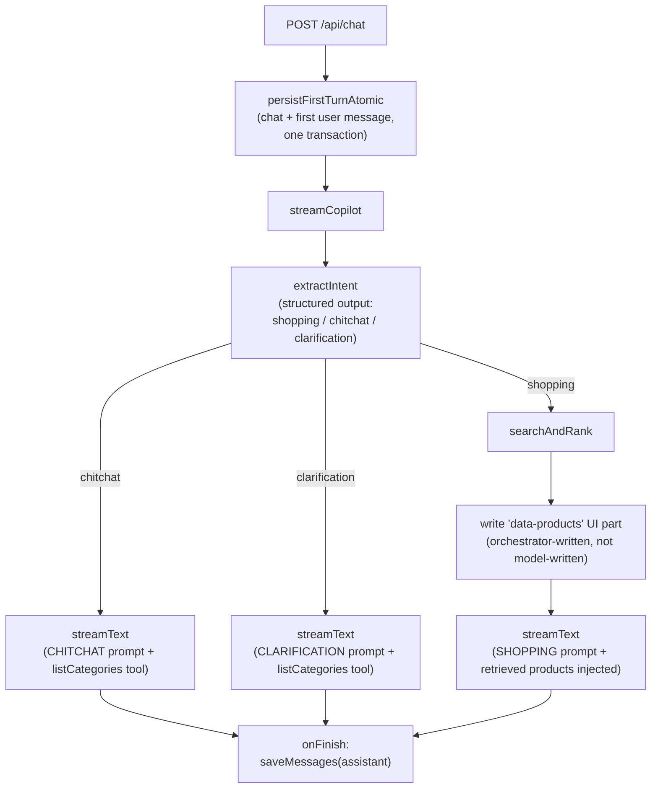
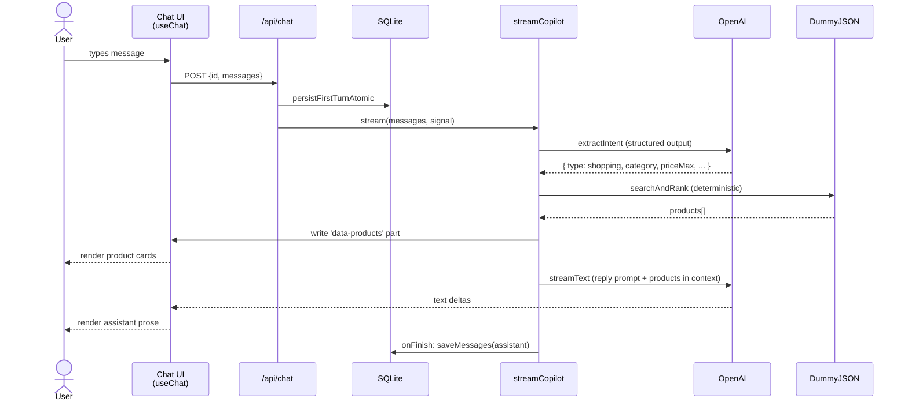

# AI Shopping Copilot

A small conversational shopping assistant over the [DummyJSON Products API](https://dummyjson.com/products). Type what you want; the assistant figures out the filters; a product carousel appears in-chat. Conversations persist; you start new ones and resume old ones from a sidebar.

Lean by design — the architecture is the point as much as the feature.

---

## Stack

- **Next.js 16** (App Router) · **React 19** · **Tailwind v4** · **shadcn/ui** (`radix-maia`)
- **Vercel AI SDK v6** with `gpt-5.4-mini` via `@ai-sdk/openai`
- **SQLite** (`better-sqlite3`) via **Drizzle ORM** — conversation history, atomic writes, WAL mode
- **openapi-fetch** + **openapi-typescript** — typed DummyJSON calls from a committed spec
- **Zod** — single source of truth for the normalised `Product` shape (runtime parsing + TS types)
- Tests: **vitest** + **@testing-library/react** + **msw**; E2E **@playwright/test**; LLM behaviour pinned by an **evals** suite

---

## Running it

```bash
pnpm install
cp .env.example .env.local       # add your OPENAI_API_KEY
pnpm db:migrate                  # creates ./local.db
pnpm dev                         # http://localhost:3000
```

Always `pnpm`. Never npm, npx, or yarn — see [`CLAUDE.md`](./CLAUDE.md).

| Command | What it does |
| --- | --- |
| `pnpm dev` | Dev server on `:3000` |
| `pnpm test` | Vitest (unit + integration + component) |
| `pnpm test:e2e` | Playwright on `:3100` against a prod build with a seeded DB — no LLM calls |
| `pnpm eval` | LLM evals against real OpenAI (`OPENAI_API_KEY` required) |
| `pnpm gen:openapi` | Regenerate `lib/products/openapi-types.ts` from the YAML spec |
| `pnpm db:generate` | Diff schema → new migration file |
| `pnpm db:migrate` | Apply migrations to `$DATABASE_FILE` (defaults to `./local.db`) |

---

## Architecture

The principle: **the LLM never decides whether to retrieve.** A structured-output classifier routes the request, the orchestrator runs deterministic retrieval, and the model only narrates around results it didn't choose.

### Per-turn pipeline



### Request lifecycle (shopping branch)



### Architectural guarantees

Each of these is a structural property of the code — not a prompt instruction the model might forget.

- **Hallucination guard (structural).** Product cards on screen render from the `data-products` UI message part the orchestrator emits, populated from the deterministic `searchAndRank` result. The model literally cannot put a product card on screen — it can only describe one in prose. The reply prompt forbids product titles/prices/IDs in text; the eval suite (`textMentionsAnyProductTitle`) asserts the text doesn't leak. Two layers, one upstream of the other, so a prompt slip doesn't cascade into a visible fake card.
- **Deterministic retrieval.** `extractIntent` returns a typed object; the orchestrator passes its fields straight to `searchAndRank`. The model never decides *whether* to search, only the prose around the result. No tool-loop, no non-determinism in the retrieval path, no "did it call the tool this time?" question to debug.
- **Anti-corruption layer at the LLM/data boundary.** `lib/products/normalize-input.ts` reconciles what the classifier said with what the catalogue actually has — drops invented category slugs, promotes a slug-shaped query to category, treats `0` as "no constraint" rather than "max $0". The classifier is intentionally blind to the live slug list (no dynamic prompt injection); validation happens here instead, in one cached `fetchCategories` call.
- **Single read-only tool surface.** `listCategories` is the only model-facing tool. Read-only, available on the reply step only, never on the routing or retrieval step. The model uses it to ground prose ("we don't carry hair products, but we do have…") without ever competing with `searchAndRank` for control.
- **Off-topic handling is structural.** `intent.type === 'chitchat'` short-circuits before any retrieval. No "did the model decide to call the tool?" stochasticity for "what's the weather?".
- **Sidebar is the sole chat-navigation surface.** No auto-`router.replace` after the first message; the sidebar updates via SWR `mutate('/api/chats')`. One canonical place for chat history navigation.

---

## Tradeoffs (and what we'd revisit)

| Decision | What we get | What we give up |
| --- | --- | --- |
| **Deterministic intent classification** instead of model-driven tool loop | Predictable retrieval, structural off-topic handling, evals that aren't phrasing-dependent | Two model calls per shopping turn instead of one (classifier + reply); fixed action space |
| **DummyJSON as the catalogue** | Free, real product data, OpenAPI-typed | Quirks: `/search` is literal substring (no stemming — we retry singular/plural inside `fetchProducts`); no "search within category" endpoint |
| **SQLite + Drizzle** instead of Postgres | Local-first dev, transactional writes, free SSR on resume, single-file backup | Single-instance only; multi-instance deploy needs Postgres + dialect swap |
| **In-process 5-min category cache** | One DummyJSON roundtrip per server start | Stale-per-instance on multi-instance deploy; bust would need a Redis-or-equivalent signal |
| **Anti-corruption layer** for LLM tool input (`lib/products/normalize-input.ts`) | Search code stays clean; LLM slips (invented slugs, zero placeholders, redundant queries) absorbed at the boundary | Boundary code accumulates one helper per observed model failure mode — needs periodic review when prompts evolve |
| **`useChat` + SWR, no Zustand** | Less code, framework-native | One large `useChat` per chat surface — if state grows past sidebar + transcript, revisit |
| **E2E seeds DB and skips the LLM** | Deterministic, free, fast, runnable in CI | The send-a-new-message path is verified only by `pnpm eval` (real OpenAI, costs money) |
| **`gpt-5.4-mini`** | Cheap, fast, strong structured-output support | Newer GPT-5 family — older tooling may not recognise the model id |
| **No auth, no rate limit, no streaming resumption** | Smaller surface, faster to ship as a showcase | Not deployable as-is to a multi-user setting |

---

## Testing strategy

Five layers, each chosen for what only it can catch:

| Layer | Tool | What it catches | Cost |
| --- | --- | --- | --- |
| **Unit** | `vitest` | Pure logic — `narrow()`, `searchAndRank`, `normalize-input`, `formatProductsContext`, `tryMapProduct` log-and-skip | <1s, free |
| **Component** | `vitest` + `@testing-library/react` | Render shape — product card, message item, chat input keyboard handling | <1s, free |
| **Integration** | `vitest` against mocked boundaries | Branch wiring — `POST /api/chat` error classification, `streamCopilot` calls the right system prompt per branch, `data-products` emitted only on shopping, `abortSignal` threading | <1s, free |
| **E2E** | `@playwright/test` on port 3100 | Full UI flow — sidebar list, click-to-resume, refresh-survives, delete confirm + toast, active-chat-delete redirect. Seeds a deterministic SQLite; skips the LLM. | ~10s, free |
| **Evals** | Custom runner against real OpenAI | Behavioural guarantees the unit tests can't assert — intent routing on real natural language, retrieval relevance, **and the prompt-rule surface** (no markdown, no product names in text, apologise on empty, steer back on off-topic, end clarification with `?`). Gated out of `pnpm test` for cost + determinism. | ~$0.05/run |

The **eval suite's text assertions** are the unusual piece. Most LLM apps test "did the model produce *something*?" — this one parses the v6 UI-message SSE stream, recovers the assistant's prose, and asserts on rules the system prompts make:

- `textMentionsAnyProductTitle` — hallucination guard, runs on every shopping case.
- `textContainsApology` — empty-result branch must apologise + refine.
- `textSteersToShopping` — chitchat must redirect.
- `textIsQuestion` — clarification must end with `?`.
- `textHasNoMarkdown` — every reply must be plain prose.
- `textIsConcise` — sentence-count budget per branch.

Run `pnpm eval` after changing prompts or the intent schema.

---

## Operational hygiene

- **Atomic first-turn persistence.** `persistFirstTurnAtomic` (`lib/db/queries.ts`) wraps the chat-create + first-message insert in a single SQLite transaction with `.onConflictDoNothing()` on both inserts. Concurrent POSTs with the same chat id (double-click, optimistic retransmit) converge on the same final state instead of 500-ing on a PK collision.
- **Structured error classification.** `POST /api/chat` maps provider error shapes to HTTP semantics in 30 lines: 429 → `429 + Retry-After: 5`, 401/403 → `503`, default → `500`. Errors log with structured context (`{chatId, lastUserMessageId, classifiedStatus}`) for downstream pipelines.
- **`AbortSignal` threading.** `request.signal` flows from the route through `streamCopilot` into `streamText({ abortSignal })`. Client navigates away mid-stream → token burn stops at the provider.
- **Request validation.** Body size capped (1 MB) before parsing; Zod-validated for `{id, messages}` shape with permissive `parts`. Bad JSON → 400, oversized → 413, malformed shape → 400.
- **DB hygiene.** `chats_created_at_idx` and `messages_chat_id_idx` on the hot read paths (`EXPLAIN QUERY PLAN` confirms index use). WAL mode + foreign-key enforcement in `lib/db/client.ts`. Drizzle migrations committed (`lib/db/migrations/`).
- **Defensive coercion at boundaries.** `tryMapProduct` log-and-skips a single malformed DummyJSON product instead of throwing out of the stream and killing the whole turn. `fetchCategories` is wrapped in `.catch(() => [])` at the single normalize-input entry point — DummyJSON outage degrades to "no slug list" rather than a 500.
- **Persistence failure isolation.** The `onFinish` callback wraps `saveMessages` in try/catch. If the DB write fails after the stream drained, the client still gets its response and the failure logs with full context (no half-success that looks like success).

---

## Repo structure

```text
app/
  page.tsx                 New-chat landing (fresh nanoid)
  chat/[id]/page.tsx       Resume — SSR-hydrated from DB
  api/
    chat/route.ts          Streaming POST; error classification; atomic first-turn write
    chats/route.ts         Sidebar list (GET)
    chats/[id]/route.ts    DELETE only (read path goes through the server component)
components/
  chat/                    Chat surface, message list/input
  products/                In-chat product card + carousel
  app-sidebar.tsx          Sidebar with delete confirm
  ui/                      shadcn primitives
lib/
  ai/
    intent.ts              Flat-schema classifier + narrow() to discriminated union
    orchestrator.ts        The pipeline above; one reply-step helper
    prompts.ts             Three branch system prompts + formatProductsContext
    tools.ts               listCategories (the only model-facing tool)
  products/
    client.ts              openapi-fetch wrapper; singular/plural retry; 5-min category cache
    search.ts              Deterministic filter/sort/limit; retrievePool routing
    normalize-input.ts     Anti-corruption layer for LLM tool input
    types.ts               Zod-derived Product; tryMapProduct (log-and-skip on bad rows)
  db/
    schema.ts              chats + messages, indexed
    client.ts              better-sqlite3 singleton, WAL + FK enforcement
    queries.ts             CRUD + persistFirstTurnAtomic (idempotent under concurrent POSTs)
  evals/
    cases.ts               Eval cases — assert intent shape + retrieval result + assistant text
    assertions.ts          Pure helpers (intent type, products count, text rules)
    runner.ts              End-to-end through extractIntent + streamCopilot
tests/
  fixtures/                Real DummyJSON snapshots
  mocks/                   MSW handlers
  e2e/                     Playwright specs (seeded DB, port 3100)
dummyjson_products_openapi.yaml   Committed; input to gen:openapi
```

---

## Troubleshooting

**`Error: model not found` / 404 from OpenAI.** Confirm `OPENAI_API_KEY` in `.env.local` is set and the account has access to `gpt-5.4-mini`. To use a different model, edit the `OPENAI_MODEL_ID` constant in `lib/ai/model.ts` — both `lib/ai/orchestrator.ts` and `lib/ai/intent.ts` read from it.

**Native build of `better-sqlite3` fails on `pnpm install`.** pnpm 10 blocks lifecycle scripts by default. From the repo root: `pnpm rebuild better-sqlite3`. If that fails, check your Node version (24 LTS is the floor here) and that you have build tools installed (`xcode-select --install` on macOS).

**Migrations are out of sync after a schema change.** `pnpm db:generate` to produce a new migration file, then `pnpm db:migrate` to apply it. Drizzle keeps a journal in `lib/db/migrations/meta/`.

**Tests fail on the first `pnpm test` run but pass on retry.** Known intermittent — likely cross-file `vi.mock('ai', …)` pollution. Re-run usually clears it. If a fix is wanted, try `pnpm test --no-file-parallelism` to confirm it's isolation-related.

**Sidebar doesn't show the chat I just started.** The orchestrator's `onFinish` triggers a `mutate('/api/chats')`. If the stream errored before `onFinish`, the sidebar won't refresh. Reload the page.

**`pnpm test:e2e` fails with "port 3100 in use".** A previous Playwright run didn't shut down cleanly. `lsof -ti:3100 | xargs kill -9`.

**`pnpm eval` says no key.** Evals load `.env.local` via `tsx --env-file`. Confirm `OPENAI_API_KEY` is in that file (not just exported to your shell).

**Product cards show but the assistant text mentions a product not on screen.** Eval failure mode — the reply prompt forbids product details in text. Run `pnpm eval` to see if it's reproducible; tighten the prompt in `lib/ai/prompts.ts::SHOPPING_SYSTEM_PROMPT` if so.

**DummyJSON search misses a product I can see in the catalogue.** Their `/search` endpoint is literal substring (no stemming). `fetchProducts` already retries the singular/plural twin (`selfie sticks` → `selfie stick`) — for more exotic mismatches, fall back to a category fetch and post-filter in `searchAndRank`.

